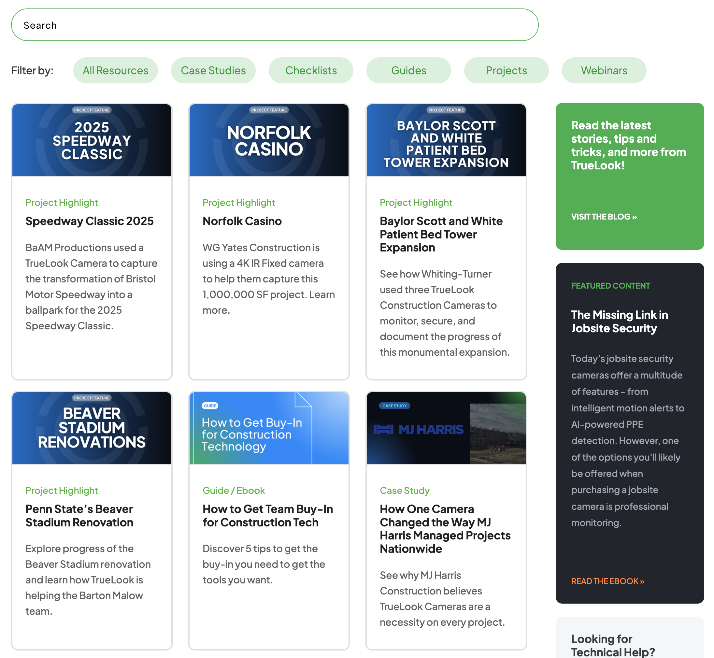

# AJAX Resource Feed – WordPress Theme Component

This WordPress theme component implements a dynamic resource feed using a **custom post type**, organized by **custom taxonomies**. It allows users to filter the feed using taxonomy terms and a keyword search input. Results are loaded via AJAX.

## Features

- **Theme Integrations**
  Implemented using the default WordPress templating engine by including a custom page template
  `page-resource.php`

- **AJAX-Powered Filtering**  
  Users can refine results without reloading the page using a combination of taxonomy filter and search input.
  `inc/resource-ajax.php`, `js/resources-ajax.js`

- **Custom Post Type:**  
  Dedicated to various resource content types such as PDFs, links, guides, etc.
  `inc/custom-post-types.php`

- **Custom Taxonomies:**  
  Organizes resources into categories and tags (e.g., Case Studies, Whitepapers, Webinars).
  `inc/custom-taxonomies.php`
  
- **Search Integration**  
  Combines keyword search with taxonomy filtering.
  `searchform-resource.php`

- **Optimized for Speed**  
  Results load instantly with minimal server load and no page refreshes.
  
## Sreenshot

